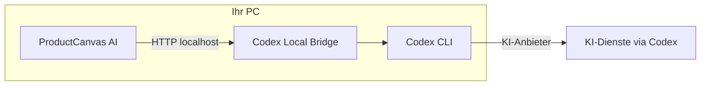

# Produkt

ProductCanvas AI ist ein universelles Desktop-Studio für KI-gestützte Marketingbilder. Es ist nicht an eine Branche oder Marke gebunden – Sie liefern Vorlagen und Produktfotos; die App orchestriert lokale KI für das fertige Bild.

## Vision

Marketing- und E-Commerce-Teams brauchen konsistente Produktvisuals ohne aufwendige Design-Software. ProductCanvas AI:

- Sichert **Layout-Konsistenz** durch wiederverwendbare Vorlagen
- Erhält **Produkttreue** durch Referenzanalyse und Bild-Anhänge
- Nutzt **KI lokal** über Codex CLI und Codex Local Bridge – Anfragen laufen auf Ihrem Rechner, nicht über einen proprietären Cloud-Renderer des App-Herstellers

Derselbe Workflow gilt für Elektronik, Möbel, Mode, Industrieprodukte oder jedes fotografierbare Produkt in einer Vorlage.

## Zielgruppe

- Marketing auf Windows-Arbeitsplätzen
- Kleine Studios mit wiederholbaren Produkt-im-Layout-Bildern
- Entwickler, die Vorlagen und Automatisierung im Codex-Ökosystem erweitern

## Architektur

| Komponente | Rolle |
|------------|-------|
| **ProductCanvas AI** | Electron-App: UI, Vorlagen, Profile, Prompt-Builder, Bild-Pipeline |
| **Codex Local Bridge** | Lokaler HTTP-Server; Pairing mit der App; Jobs an Codex CLI |
| **Codex CLI** | Kommandozeile zu KI-Modellen (Text + Bild) |
| **Vorlagen** | PNG-Layout-Master (System + Benutzer) |
| **Profile** | Gespeicherte Projekte (`.pcprofile.json`) |

### Prozessgrenzen

- **Renderer** (UI) ruft die Bridge **nicht** direkt auf – Netzwerk-I/O nur im **Electron-Main-Prozess** mit Job-Token und Request-Hash.
- **Preload** exponiert eine schmale IPC-API.
- **Sharp** bereitet Bilder lokal vor (Größe, Format) vor dem Bridge-Upload.

### Zentrale Pipelines

1. **Prompt-Builder** – analysiert Referenzen, extrahiert Produktbeschreibung, erzeugt strukturierten Bild-Prompt.
2. **Bild-Preflight** – bei Referenz- oder Vorlagen-Anhang Optimierung des finalen Prompts unmittelbar vor der Generierung.
3. **Bild-Pipeline** – Bridge `/v1/images` mit Anhängen, Base64-PNG-Vorschau.
4. **Vorlagen-Bearbeitungs-Pipeline** – gleicher Bridge-Weg mit Akzeptieren/Verwerfen.

## Codex Local Bridge

Standard-Endpunkt: `http://127.0.0.1:8765`.

- **Pairing:** 6-stelliger Code aus dem Bridge-Tray; Speicher in `bridge-state.json`.
- **App-Origin:** `http://127.0.0.1:9473` identifiziert ProductCanvas AI gegenüber der Bridge.
- **Referenzbilder:** Bridge **≥ 1.0.4** für Weiterleitung an Codex.
- **Timeouts:** Bis 30 Minuten pro langem Bild-Job.

Die App kann Bridge unter Windows beim Erststart laden und starten. Manuelle Installation von [codex-local-bridge](https://github.com/alorbach/codex-local-bridge) möglich.

## Lokaler Datenschutz

| Daten | Lokal? | Hinweise |
|-------|--------|----------|
| Vorlagen, Profile, Sitzung | Ja | `%APPDATA%\productcanvas-ai\` |
| Gewählte Referenzfotos | Ja | Von Festplatte; in Profilordner kopiert beim Speichern |
| Bridge-Pairing-Token | Ja | Lokale JSON-Datei |
| KI-Anfragen | Via Codex CLI | Codex-/Anbieter-Richtlinien – Sie kontrollieren CLI-Login |

ProductCanvas AI betreibt keinen zentralen Bild-Upload-Dienst. Bilder und Prompts laufen über Ihre lokale Bridge zur Codex CLI. Cloud-Verarbeitung: Codex- und Anbieter-Bedingungen prüfen.

## Universelle Anwendungsfälle

| Anwendungsfall | Nutzen |
|----------------|--------|
| Produkt-im-Layout-Werbung | Vorlage + Packshot-Referenzen |
| Saisonale Kampagnen | Vorlage klonen, Farben per KI, Profile stapeln |
| Mehrere SKUs | Profil pro SKU, gemeinsame Vorlage |
| Vorlagen-Bibliothek | PNG-Master aus beliebigem Design-Tool importieren |
| Nicht-destruktive KI-Edits | Akzeptieren/Verwerfen bei Vorlagenänderungen |

Ersetzen Sie mitgelieferte System-Vorlagen durch eigene Layouts für jede visuelle Identität.

## Standardverhalten

- **Auflösung:** Vorlagenmaß bei „Vorlage (B×H)“; Fallback 1536×1024 ohne bekannte Maße
- **Qualität:** Hoch
- **UI-Sprache:** Automatisch aus Windows-Locale (Deutsch oder Englisch)
- **Letzte Vorlage:** Beim Start vorausgewählt, wenn in der Sitzung gespeichert

## Abhängigkeiten und Lizenz

- **ProductCanvas AI** – GPL-2.0-or-later
- **Codex Local Bridge** – separates Projekt ([alorbach/codex-local-bridge](https://github.com/alorbach/codex-local-bridge))
- **Codex CLI** – Laufzeitvoraussetzung für KI-Funktionen

Copyright © [Andre Lorbach](https://github.com/alorbach).

## Verwandte Themen

- [Benutzerhandbuch](benutzerhandbuch.md)
- [Entwickler](entwickler.md)
- [Erste Schritte](einrichtung.md)

---

Copyright © [Andre Lorbach](https://github.com/alorbach). Lizenz: [GPL-2.0-or-later](https://www.gnu.org/licenses/old-licenses/gpl-2.0.html).
