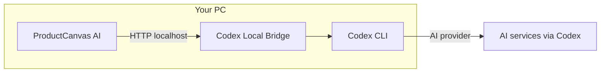

# Product

ProductCanvas AI is a universal desktop studio for AI-assisted marketing images. It is not tied to a single industry or brand—you supply templates and product photos; the app orchestrates local AI to compose the final artwork.

## Vision

Marketing and e-commerce teams often need consistent product visuals across campaigns without manual work in complex design tools. ProductCanvas AI:

- Keeps **layout consistency** through reusable templates
- Preserves **product fidelity** through reference-photo analysis and attachment
- Runs **AI locally** via Codex CLI and Codex Local Bridge—requests go to your machine, not a proprietary cloud renderer controlled by the app vendor

The same workflow applies to electronics, furniture, fashion, industrial parts, or any product you can photograph and place into a template.

## Target users

- Marketing staff producing social, web, and print assets on Windows
- Small studios needing repeatable product-in-layout images
- Developers extending templates and automation around the Codex ecosystem

## Architecture

| Component | Role |
|-----------|------|
| **ProductCanvas AI** | Electron app: UI, templates, profiles, prompt building, image pipeline |
| **Codex Local Bridge** | Local HTTP server; pairs with the app; forwards jobs to Codex CLI |
| **Codex CLI** | Command-line interface to AI models (text + image) |
| **Templates** | PNG layout masters (system + user) |
| **Profiles** | Saved projects (`.pcprofile.json`) |

### Process boundaries

- **Renderer** (UI) never calls the bridge directly—all network I/O runs in the **Electron main process** through a bridge client with job tokens and request hashing.
- **Preload script** exposes a narrow IPC API to the renderer.
- **Sharp** handles local image prep (resize, format) before upload to the bridge.

### Key pipelines

1. **Prompt builder** – analyzes reference images, extracts product description, emits structured image prompt.
2. **Image preflight** – when references or template attachment are present, optimizes the final prompt immediately before generation.
3. **Image pipeline** – calls bridge `/v1/images` with attachments and retrieves base64 PNG preview.
4. **Template edit pipeline** – same bridge path for AI layout modifications with accept/reject gate.

## Codex Local Bridge

ProductCanvas AI expects a bridge instance at `http://127.0.0.1:8765` by default.

- **Pairing:** 6-digit code from the bridge tray; stored in `bridge-state.json`.
- **App origin:** `http://127.0.0.1:9473` identifies ProductCanvas AI to the bridge.
- **Reference images:** Require bridge **≥ 1.0.4** for attachment forwarding to Codex.
- **Timeouts:** Up to 30 minutes per long-running image job.

The app can download, install, and launch the bridge on first use (Windows). Manual installation from [codex-local-bridge](https://github.com/alorbach/codex-local-bridge) is also supported.

## Local privacy and data

| Data | Stays local? | Notes |
|------|--------------|-------|
| Templates, profiles, session | Yes | `%APPDATA%\productcanvas-ai\` |
| Reference photos you select | Yes | Read from your disk; copied into profile folders on save |
| Bridge pairing token | Yes | Local JSON file |
| AI requests | Via Codex CLI | Subject to Codex CLI / provider policies—you control CLI login |

ProductCanvas AI does not operate a central image-upload service. Images and prompts pass through your local bridge to Codex CLI. Review Codex and your AI provider terms for cloud processing details.

## Universal use cases

| Use case | How ProductCanvas AI helps |
|----------|----------------------------|
| Product-in-layout ads | Template + packshot references |
| Seasonal campaigns | Clone template, AI-edit colors, batch profiles |
| Multi-SKU lines | Save one profile per SKU with shared template |
| Template library | Import PNG masters from any design tool |
| Non-destructive AI edits | Accept/reject gate on template changes |

Replace bundled system templates with your own artwork to match any visual identity.

## Default behavior

- **Resolution:** Template-native size when “Template (WxH)” is selected; fallback 1536×1024 if dimensions unknown
- **Quality:** High
- **UI language:** Automatic from Windows locale (English or German)
- **Last template:** Pre-selected on startup when remembered in session

## Dependencies and license

- **ProductCanvas AI** – GPL-2.0-or-later
- **Codex Local Bridge** – separate project ([alorbach/codex-local-bridge](https://github.com/alorbach/codex-local-bridge))
- **Codex CLI** – required runtime for AI features

Copyright © [Andre Lorbach](https://github.com/alorbach).

## Related topics

- [User Guide](user-guide.md) – end-user overview
- [Developer](developer.md) – build, test, release
- [Getting Started](getting-started.md) – setup steps

---

Copyright © [Andre Lorbach](https://github.com/alorbach). Licensed under [GPL-2.0-or-later](https://www.gnu.org/licenses/old-licenses/gpl-2.0.html).
